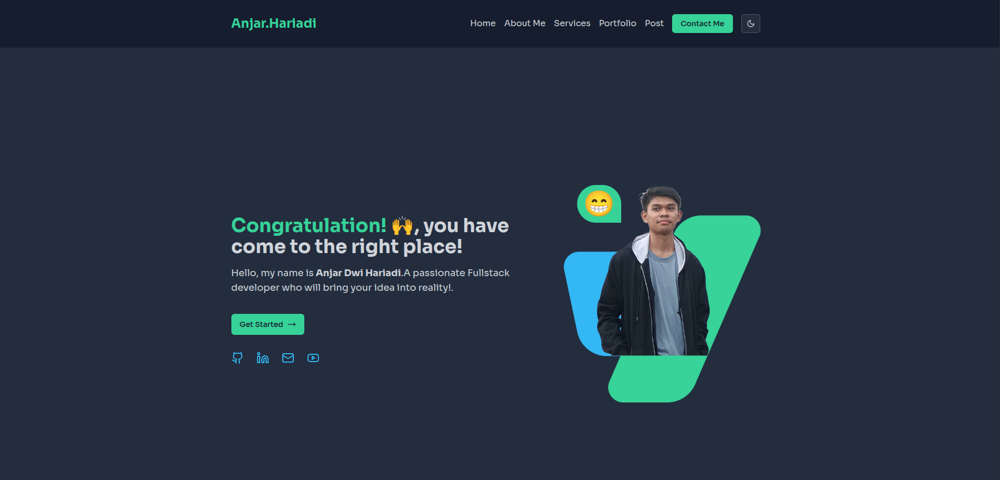

# Anjar Hariadi Portfolio Website

This is my personal website built using [Next.js](https://nextjs.org), [Prisma](https://prisma.io), [Tailwind CSS](https://tailwindcss.com), [tRPC](https://trpc.io), and [Supabase](https://supabase.com/)

## Features

- Next.Js with typescript
- Shadcn Component
- Prisma ORM (PostgreSql via Supabase)
- Personal dashboard.
  I can manage all my information including profile, portfolio, experience, certificate, blog post from dashboard page, so whenever i want to update some information i don't have to change the code, all protected with Supabase Auth.

## Under Development Feature(s)

- Blog
